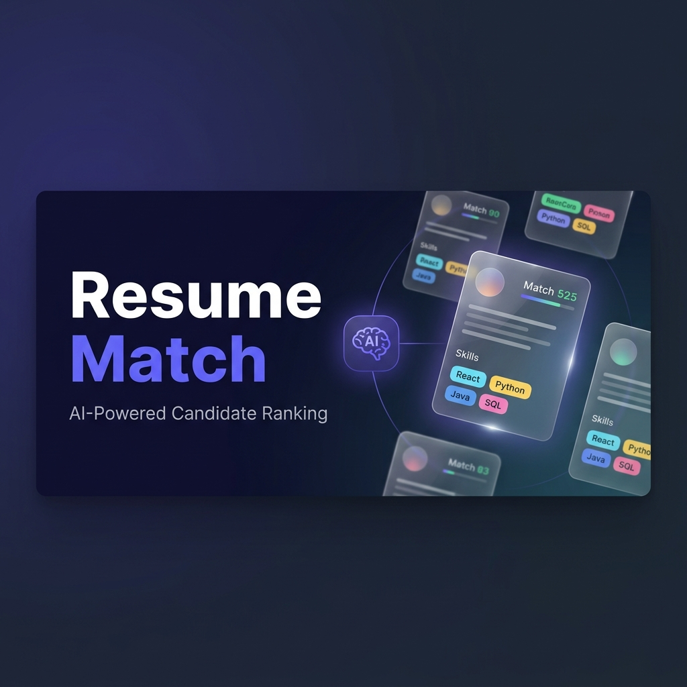

<p align="center">
  
</p>

<h1 align="center">Resume Match — AI-Powered Candidate Ranking</h1>

<p align="center">
  <strong>Upload resumes. Paste a job description. Get AI-ranked candidates in seconds.</strong>
</p>

<p align="center">
  <a href="https://resume-screening-candidate-ranking-five.vercel.app" target="_blank">
    
  </a>
  &nbsp;
  <a href="https://resume-screening-candidate-ranking.vercel.app/api/health" target="_blank">
    
  </a>
</p>

<p align="center">
  
  
  
  
  
  
</p>

---

## ✨ What It Does

**Resume Match** automates the most tedious part of hiring — reading through stacks of resumes. You provide a job description and upload candidate resumes (PDF, DOCX, TXT). The AI analyzes each one and returns a ranked, scored report you can export and share.

| Step | What Happens |
|------|-------------|
| **1. Provide Job Details** | Paste a JD, fetch from a URL, or upload a JD document |
| **2. Upload Resumes** | Drag & drop up to 20 PDFs, DOCX or TXT files at once |
| **3. AI Ranking** | Groq (Llama 3.3 70B) scores every candidate across 4 dimensions |
| **4. Export** | Download ranked results as a formatted Excel or CSV report |

---

## 📸 Screenshots

<table>
  <tr>
    <td align="center">
      
      <br/><sub><b>Landing Page</b></sub>
    </td>
    <td align="center">
      
      <br/><sub><b>Upload Form — JD + Resumes</b></sub>
    </td>
  </tr>
  <tr>
    <td align="center">
      
      <br/><sub><b>AI-Ranked Results with Score Breakdown</b></sub>
    </td>
    <td align="center">
      
      <br/><sub><b>Excel Export with Color-Coded Scores</b></sub>
    </td>
  </tr>
</table>

---

## 🏗️ Architecture

```
┌──────────────────────────────────────────────────┐
│        Next.js 14 Frontend (Vercel)              │
│        React · TypeScript · Vanilla CSS          │
└────────────────────┬─────────────────────────────┘
                     │ REST API (HTTPS)
┌────────────────────▼─────────────────────────────┐
│       Node.js + Express v5 Backend               │
│       (Vercel Serverless Functions)              │
│                                                  │
│   ┌─────────────┐        ┌──────────────┐       │
│   │ File Parser  │        │  AI Scorer   │       │
│   │ pdf-parse   │        │  Groq API    │       │
│   │ mammoth     │        │  Llama 3.3   │       │
│   └─────────────┘        └──────────────┘       │
└────────────────────┬─────────────────────────────┘
                     │ SQL over TLS
┌────────────────────▼─────────────────────────────┐
│         Neon PostgreSQL (Cloud)                  │
│         jobs · candidates · scores               │
└──────────────────────────────────────────────────┘
```

---

## 🧠 AI Scoring Model

Each resume is scored out of **100 points** across 4 equal dimensions using **Llama 3.3 70B** via Groq:

| Dimension | Points | What It Evaluates |
|-----------|--------|-------------------|
| 🛠️ Skills | 0–25 | Domain-specific skill match |
| 💼 Experience | 0–25 | Relevance of past work history |
| 🎓 Education | 0–25 | Degree and qualification fit |
| 🔑 Keywords | 0–25 | JD keyword and tool presence |

The prompt enforces a **Domain Mismatch Rule** — candidates from the wrong field (e.g., a software engineer applying for a bilingual writing role) are scored honestly (15–40 range) rather than inflated by superficial keyword overlap.

---

## 🚀 Tech Stack

| Layer | Technology |
|-------|-----------|
| **Frontend** | Next.js 14, React, TypeScript, Vanilla CSS |
| **Backend** | Node.js, Express v5, Multer v2 |
| **AI / LLM** | Groq API — Llama 3.3 70B Versatile |
| **File Parsing** | pdf-parse, mammoth (DOCX) |
| **Database** | Neon PostgreSQL (serverless) |
| **Exports** | ExcelJS (XLSX), json2csv (CSV) |
| **Frontend Hosting** | Vercel |
| **Backend Hosting** | Vercel Serverless Functions |

---

## 🛠️ Local Development

### Prerequisites
- Node.js 18+
- A [Neon](https://neon.tech) PostgreSQL database
- A [Groq](https://console.groq.com) API key (free tier available)

### 1. Clone the repo

```bash
git clone https://github.com/Bhaumik1904/Resume-Screening-Candidate-Ranking-Web-Application.git
cd Resume-Screening-Candidate-Ranking-Web-Application
```

### 2. Set up the Backend

```bash
cd backend
npm install
```

Create a `.env` file in the `backend/` directory:

```env
PORT=5000
DATABASE_URL="your_neon_postgresql_connection_string"
GROQ_API_KEY="your_groq_api_key"
FRONTEND_URL=http://localhost:3000
NODE_ENV=development
```

Initialize the database schema:

```bash
# Run the schema against your Neon database
psql $DATABASE_URL -f src/db/schema.sql
```

Start the backend:

```bash
npm run dev
# API running at http://localhost:5000
```

### 3. Set up the Frontend

```bash
cd frontend
npm install
```

Create a `.env.local` file in the `frontend/` directory:

```env
NEXT_PUBLIC_API_URL=http://localhost:5000
```

Start the frontend:

```bash
npm run dev
# App running at http://localhost:3000
```

---

## 🌐 API Endpoints

| Method | Endpoint | Description |
|--------|----------|-------------|
| `POST` | `/api/upload` | Upload resumes + job description |
| `POST` | `/api/analyze/:jobId` | Trigger AI scoring for all candidates |
| `GET` | `/api/results/:jobId` | Fetch ranked results |
| `GET` | `/api/results/:jobId/export?format=csv\|excel` | Download report |
| `POST` | `/api/parse-jd` | Extract text from a JD file |
| `POST` | `/api/scrape-url` | Fetch JD from a public URL |
| `GET` | `/api/health` | Health check (DB + API key status) |

---

## ☁️ Deployment

Both frontend and backend are deployed on **Vercel** for free (no credit card required).

### Environment Variables

**Backend (Vercel)**
```
DATABASE_URL        → Neon PostgreSQL connection string
GROQ_API_KEY        → Groq API key
FRONTEND_URL        → Your deployed frontend URL (for CORS)
```

**Frontend (Vercel)**
```
NEXT_PUBLIC_API_URL → Your deployed backend URL
```

> **Note:** `NEXT_PUBLIC_*` variables are baked into the build at compile time. Always redeploy the frontend after changing this variable.

---

## 📁 Project Structure

```
Resume-Screening-Candidate-Ranking-Web-Application/
├── backend/
│   ├── api/
│   │   └── index.js          # Vercel serverless entry point
│   ├── src/
│   │   ├── db/
│   │   │   ├── index.js      # PostgreSQL connection pool
│   │   │   ├── queries.js    # All SQL queries
│   │   │   └── schema.sql    # Table definitions
│   │   ├── routes/
│   │   │   ├── upload.js     # Resume + JD upload handler
│   │   │   ├── analyze.js    # AI scoring orchestrator
│   │   │   ├── results.js    # Results + export endpoints
│   │   │   ├── parseJd.js    # JD file parser
│   │   │   └── scrapeUrl.js  # URL scraper
│   │   ├── services/
│   │   │   ├── aiScorer.js   # Groq LLM integration + prompt
│   │   │   ├── fileParser.js # PDF/DOCX text extraction
│   │   │   └── exportService.js # CSV/Excel generation
│   │   └── index.js          # Express app setup
│   ├── package.json
│   └── vercel.json
├── frontend/
│   ├── app/
│   │   ├── page.tsx          # Main application page
│   │   └── globals.css       # Design system + styles
│   ├── public/
│   └── package.json
├── docs/
│   └── screenshots/          # README screenshots
└── sample-resumes/           # Sample files for testing
```

---

## 📄 License

MIT License — feel free to fork, modify, and use for your own projects.

---

<p align="center">
  Built with ❤️ using Next.js, Groq, and Neon PostgreSQL
  <br/>
  <a href="https://resume-screening-candidate-ranking-five.vercel.app">🚀 Try the live demo</a>
</p>
